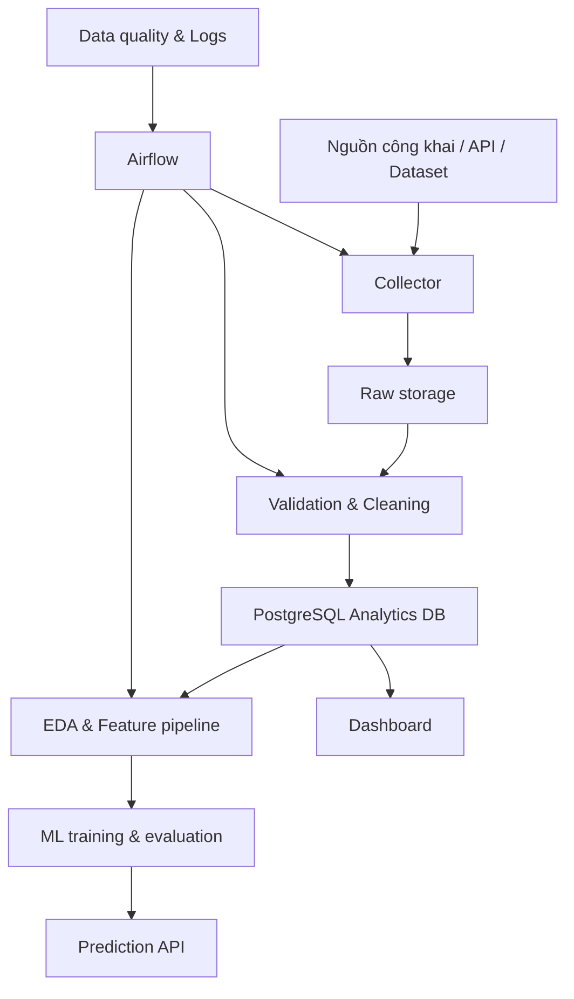

# THIẾT KẾ TỔNG THỂ DỰ ÁN

## Phân tích và dự đoán thị trường việc làm IT Việt Nam

## 1. Bài toán

Dữ liệu tuyển dụng IT tại Việt Nam phân tán trên nhiều nền tảng, khác nhau về cách đặt tên vị trí, kỹ năng, mức lương và địa điểm. Dự án xây dựng một pipeline dữ liệu có khả năng thu thập định kỳ, chuẩn hóa, lưu trữ, phân tích và huấn luyện mô hình dự đoán nhằm trả lời các câu hỏi thực tế về thị trường.

Sản phẩm cuối gồm:

- Pipeline ETL/ELT tự động và có thể tái lập.
- Kho dữ liệu tin tuyển dụng đã chuẩn hóa.
- Báo cáo chất lượng dữ liệu và phân tích khám phá.
- Dashboard theo dõi thị trường.
- Mô hình ước lượng mức lương cho tin có công khai lương.
- API đơn giản phục vụ dashboard hoặc dự đoán.

## 2. Mục tiêu

### 2.1. Mục tiêu dữ liệu

- Thu thập hợp pháp dữ liệu tin tuyển dụng công khai hoặc từ API/dataset được phép sử dụng.
- Giữ dữ liệu thô để kiểm tra và tái xử lý.
- Chuẩn hóa chức danh, kỹ năng, địa điểm, loại hình làm việc, cấp bậc và lương.
- Theo dõi lịch sử xuất hiện của tin để nghiên cứu xu hướng theo thời gian.

### 2.2. Mục tiêu phân tích

- Nhóm nghề IT nào có nhu cầu cao?
- Kỹ năng nào xuất hiện nhiều nhất theo nghề và cấp bậc?
- Nhu cầu tuyển dụng khác nhau như thế nào giữa địa phương và hình thức làm việc?
- Mức lương thay đổi theo nghề, kinh nghiệm, kỹ năng và địa điểm ra sao?
- Những cặp kỹ năng nào thường được yêu cầu cùng nhau?
- Xu hướng nhu cầu thay đổi thế nào theo tuần/tháng?

### 2.3. Mục tiêu Machine Learning

Bài toán chính của MVP: dự đoán `salary_min` và `salary_max`, hoặc mức lương trung vị, từ các thuộc tính của tin tuyển dụng.

Bài toán mở rộng:

- Phân loại nhóm nghề từ tiêu đề và mô tả.
- Gợi ý kỹ năng còn thiếu cho một nghề mục tiêu.
- Dự báo số lượng tin tuyển dụng theo nhóm nghề/thời gian.

## 3. Phạm vi MVP

### Bao gồm

- 1–2 nguồn dữ liệu được phép sử dụng.
- Pipeline batch chạy hằng ngày.
- Dữ liệu lịch sử tối thiểu 8–12 tuần nếu muốn phân tích xu hướng.
- 8–12 nhóm nghề chuẩn hóa.
- Dashboard 4 trang.
- Một baseline và một mô hình ML cải tiến.

### Chưa bao gồm trong MVP

- Hệ thống streaming thời gian thực.
- Thu thập hàng chục nguồn cùng lúc.
- Mô hình ngôn ngữ lớn tự huấn luyện.
- Hệ thống khuyến nghị ứng viên cá nhân hóa.
- Dự báo dài hạn khi chưa có đủ lịch sử.

## 4. Người dùng mục tiêu

| Người dùng | Nhu cầu |
|---|---|
| Sinh viên/người tìm việc | Biết kỹ năng, nghề và địa điểm đang có nhu cầu |
| Nhà tuyển dụng | So sánh nhu cầu kỹ năng và mặt bằng lương |
| Giảng viên/nhóm nghiên cứu | Có dữ liệu và quy trình tái lập để phân tích |
| Nhóm dự án | Thực hành crawling, ETL, database, orchestration, BI và ML |

## 5. Kiến trúc đề xuất



### Luồng dữ liệu

1. Collector lấy dữ liệu theo trang hoặc thời điểm cập nhật.
2. Phản hồi gốc được lưu ở tầng raw theo ngày và nguồn.
3. Pipeline parse dữ liệu về một schema thống nhất.
4. Kiểm tra chất lượng, loại bản ghi lỗi và khử trùng lặp.
5. Load dữ liệu sạch vào PostgreSQL.
6. Tạo bảng tổng hợp phục vụ dashboard và feature set cho ML.
7. Huấn luyện, đánh giá và lưu phiên bản mô hình.

## 6. Công nghệ

| Thành phần | Công nghệ chính | Lý do |
|---|---|---|
| Thu thập | Python, Requests/BeautifulSoup hoặc API client | Phù hợp pipeline batch |
| Dữ liệu thô | JSON/JSONL hoặc Parquet theo ngày | Dễ tái xử lý và kiểm tra |
| Xử lý | Python, Pandas; Polars khi dữ liệu lớn hơn | Dễ phát triển và kiểm thử |
| Database | PostgreSQL | Phù hợp dữ liệu quan hệ và phân tích |
| Orchestration | Airflow | Lập lịch, retry, quan sát trạng thái DAG |
| Data quality | Pandera hoặc Great Expectations | Kiểm tra schema và quy tắc dữ liệu |
| ML | scikit-learn, LightGBM/XGBoost tùy môi trường | Baseline rõ ràng, hiệu quả cho tabular data |
| Theo dõi thí nghiệm | MLflow | Lưu tham số, metric và model artifact |
| Dashboard | Streamlit cho MVP; Power BI nếu cần báo cáo BI | Ra sản phẩm nhanh |
| API | FastAPI | Phục vụ dữ liệu và dự đoán |
| Đóng gói | Docker Compose | Tái lập môi trường local |
| Kiểm thử/CI | pytest, GitHub Actions | Bảo đảm pipeline ổn định |

Không đưa Kafka hoặc Spark vào MVP. Chỉ bổ sung khi volume, throughput hoặc mục tiêu môn học chứng minh được nhu cầu.

## 7. Mô hình dữ liệu

### 7.1. Bảng lõi

#### `sources`

- `source_id`
- `source_name`
- `base_url`
- `collection_method`
- `terms_checked_at`
- `is_active`

#### `companies`

- `company_id`
- `company_name_raw`
- `company_name_normalized`
- `industry`
- `company_size`

#### `locations`

- `location_id`
- `province`
- `district`
- `country`
- `latitude`, `longitude` nếu có nguồn hợp lệ

#### `job_postings`

- `job_id` UUID nội bộ
- `source_id`
- `source_job_id`
- `company_id`
- `location_id`
- `title_raw`
- `title_normalized`
- `job_category`
- `description`
- `requirements`
- `seniority_level`
- `employment_type`
- `work_mode`
- `experience_min_years`
- `experience_max_years`
- `salary_min`
- `salary_max`
- `salary_currency`
- `salary_period`
- `salary_min_vnd_month`
- `salary_max_vnd_month`
- `posted_at`
- `expires_at`
- `first_seen_at`
- `last_seen_at`
- `source_url`
- `description_hash`
- `is_active`

#### `skills`

- `skill_id`
- `skill_name`
- `skill_group`
- `aliases`

#### `job_skills`

- `job_id`
- `skill_id`
- `evidence_text`
- `extraction_method`
- `confidence`

#### `collection_runs`

- `run_id`
- `source_id`
- `started_at`, `finished_at`
- `status`
- `records_fetched`
- `records_inserted`
- `records_updated`
- `records_rejected`
- `error_message`

### 7.2. Ràng buộc quan trọng

- Unique: `(source_id, source_job_id)`.
- Không dùng URL làm khóa chính vì URL có thể thay đổi.
- `salary_min <= salary_max` khi cả hai tồn tại.
- Không biến “thỏa thuận” thành lương bằng 0; lưu `NULL`.
- Thời gian lưu theo UTC, hiển thị theo múi giờ Việt Nam.
- Raw text và normalized value phải được lưu riêng.

## 8. Chuẩn hóa dữ liệu

### Chức danh

Ánh xạ title về taxonomy ban đầu:

- Software Engineer
- Frontend Developer
- Backend Developer
- Full-stack Developer
- Mobile Developer
- Data Analyst
- Data Engineer
- Data Scientist/ML Engineer
- DevOps/Cloud Engineer
- QA/Tester
- Business Analyst
- Cybersecurity
- Other IT

Không chỉ dựa vào từ khóa `Engineer`; cần kết hợp title và mô tả khi title mơ hồ.

### Kỹ năng

- Tạo dictionary canonical: `js → JavaScript`, `postgres → PostgreSQL`, `k8s → Kubernetes`.
- Bước đầu dùng dictionary + regex có boundary.
- Lưu đoạn văn bằng chứng để kiểm tra kết quả trích xuất.
- Sau MVP có thể so sánh với NER hoặc embedding-based extraction.

### Lương

- Tách min/max, currency và period.
- Quy đổi về VND/tháng bằng bảng tỷ giá gắn ngày hiệu lực.
- Không tự suy đoán con số khi tin không công khai lương.
- Báo cáo cả coverage: tỷ lệ tin có lương hợp lệ.

### Trùng lặp

- Tầng 1: `(source_id, source_job_id)`.
- Tầng 2: hash của company + normalized title + location + description.
- Tầng 3 tùy chọn: fuzzy similarity để phát hiện cùng tin đăng lại ở nhiều nguồn.

## 9. Thiết kế pipeline Airflow

Một DAG hằng ngày:

```text
check_source_policy
    -> extract_source
    -> store_raw
    -> validate_raw
    -> transform_jobs
    -> validate_clean
    -> load_dimensions
    -> upsert_job_postings
    -> build_analytics_tables
    -> publish_quality_report
```

Yêu cầu vận hành:

- Task phải idempotent: chạy lại không tạo dữ liệu trùng.
- Có retry với exponential backoff cho lỗi tạm thời.
- Giới hạn tốc độ và không vượt cơ chế bảo vệ của website.
- Ghi metadata cho từng lần chạy.
- Không commit cookie, token hoặc thông tin bí mật vào Git.
- Tôn trọng điều khoản sử dụng, robots.txt và quyền riêng tư; ưu tiên API/dataset được cấp phép.

## 10. Data quality

Các chỉ số bắt buộc:

| Nhóm | Kiểm tra |
|---|---|
| Completeness | Tỷ lệ thiếu title, company, location, description, salary |
| Validity | Ngày hợp lệ, salary min/max hợp lệ, category thuộc taxonomy |
| Uniqueness | Tỷ lệ trùng theo source ID và content hash |
| Consistency | Currency-period và location thống nhất |
| Freshness | Độ trễ từ posted time đến collected time |
| Volume | Số bản ghi theo nguồn/ngày và cảnh báo biến động bất thường |

Ngưỡng MVP gợi ý:

- 100% bản ghi có nguồn và khóa nguồn.
- Ít nhất 98% có title và company.
- 0 bản ghi vi phạm `salary_min > salary_max` sau bước clean.
- Tỷ lệ trùng sau upsert bằng 0 theo unique key.

## 11. Phân tích và dashboard

### Trang 1 — Tổng quan

- Số tin đang hoạt động.
- Số công ty và địa phương.
- Số tin mới theo thời gian.
- Top nhóm nghề.

### Trang 2 — Kỹ năng

- Top kỹ năng tổng thể và theo nhóm nghề.
- Ma trận nghề × kỹ năng.
- Các cặp kỹ năng thường đi cùng nhau.

### Trang 3 — Lương

- Phân phối lương theo nghề, seniority và địa điểm.
- Median và IQR thay vì chỉ dùng average.
- Tỷ lệ tin công khai lương.

### Trang 4 — Xu hướng và dự đoán

- Biến động nhu cầu theo tuần/tháng.
- So sánh actual/predicted salary.
- Form nhập thuộc tính để ước lượng khoảng lương.

## 12. Thiết kế Machine Learning

### Dữ liệu huấn luyện

Chỉ dùng bản ghi có lương hợp lệ. Target ưu tiên:

`salary_mid_vnd_month = (salary_min_vnd_month + salary_max_vnd_month) / 2`

Feature:

- Title/category.
- Seniority và số năm kinh nghiệm.
- Province và work mode.
- Company industry/size nếu có.
- Skill multi-hot hoặc TF-IDF.
- Text TF-IDF từ title và requirements.
- Thời điểm đăng tin.

### Thực nghiệm

1. Baseline: median salary theo nhóm nghề.
2. Linear/Ridge model với one-hot + TF-IDF.
3. Tree boosting cho feature tabular.
4. Chỉ giữ mô hình phức tạp nếu cải thiện rõ trên tập test.

### Chia tập và đánh giá

- Chia theo thời gian, không random toàn bộ dữ liệu.
- Train trên quá khứ, test trên giai đoạn mới hơn.
- Metrics: MAE, RMSE, R² và median absolute error.
- Báo cáo metric theo job category, seniority và location.
- Kiểm tra data leakage: không dùng trường được suy ra trực tiếp từ target.

### Giới hạn cần công bố

- Tin có công khai lương có thể không đại diện toàn thị trường.
- Lương đăng tuyển không nhất thiết là lương thực nhận.
- Quy đổi ngoại tệ và cách hiểu gross/net gây sai lệch.
- Mô hình hỗ trợ tham khảo, không nên được trình bày như kết luận tuyệt đối.

## 13. API dự kiến

- `GET /health`
- `GET /api/v1/market/summary`
- `GET /api/v1/jobs/trends`
- `GET /api/v1/skills/top`
- `GET /api/v1/salaries/distribution`
- `POST /api/v1/predictions/salary`

API đọc từ bảng analytics/materialized view thay vì truy vấn raw table nặng.

## 14. Cấu trúc repository

```text
it-job-market/
├── airflow/
│   └── dags/
├── configs/
├── data/
│   ├── raw/
│   ├── interim/
│   └── samples/
├── docs/
├── notebooks/
├── reports/
├── sql/
│   ├── ddl/
│   └── marts/
├── src/
│   ├── collectors/
│   ├── validation/
│   ├── transformation/
│   ├── loading/
│   ├── analytics/
│   ├── features/
│   ├── models/
│   └── api/
├── dashboard/
├── tests/
│   ├── unit/
│   ├── integration/
│   └── fixtures/
├── docker-compose.yml
├── pyproject.toml
├── .env.example
└── README.md
```

## 15. Lộ trình 8 tuần

| Tuần | Kết quả bàn giao |
|---|---|
| 1 | Chốt câu hỏi, nguồn hợp lệ, data contract, schema và repository |
| 2 | Collector cho nguồn đầu tiên, raw storage, fixture và unit test |
| 3 | Cleaning, normalization, deduplication và quality checks |
| 4 | PostgreSQL schema, incremental upsert và Airflow DAG |
| 5 | EDA, taxonomy nghề/kỹ năng và analytics tables |
| 6 | Dashboard phiên bản đầu |
| 7 | Baseline, feature pipeline, huấn luyện và đánh giá ML |
| 8 | API, Docker, CI, tài liệu, demo và báo cáo giới hạn |

## 16. Phân công nhóm 3 người

| Vai trò | Trách nhiệm chính | Trách nhiệm chung |
|---|---|---|
| Thành viên 1 — Data ingestion | Nguồn, collector, raw layer, lịch chạy | Test, review, tài liệu |
| Thành viên 2 — Data platform | Schema, cleaning, quality, PostgreSQL, Airflow | Test, review, tài liệu |
| Thành viên 3 — Analytics/ML | EDA, feature, model, dashboard/API | Test, review, tài liệu |

Luân phiên code review để mọi thành viên hiểu toàn bộ hệ thống.

## 17. Tiêu chí hoàn thành

- Có ít nhất một nguồn dữ liệu được xác nhận quyền sử dụng.
- Pipeline chạy end-to-end bằng một lệnh hoặc một DAG.
- Chạy lại không tạo trùng dữ liệu.
- Có kiểm thử cho parser, salary normalization và deduplication.
- Có báo cáo chất lượng sau mỗi batch.
- Dashboard dùng dữ liệu từ database, không đọc file chỉnh tay.
- ML được so với baseline và test theo thời gian.
- Repository không chứa secret hoặc dữ liệu cá nhân không cần thiết.
- README đủ để thành viên mới chạy lại dự án.

## 18. Quyết định cần chốt trước khi viết collector

1. Nguồn dữ liệu đầu tiên và điều kiện sử dụng của nguồn.
2. Khoảng thời gian thu thập và tần suất chạy.
3. Dự án dùng Streamlit hay Power BI cho sản phẩm cuối.
4. Có bắt buộc dùng Airflow/PostgreSQL/Docker theo môn học hay không.
5. Tiêu chí tối thiểu về số lượng bản ghi.

## 19. Bước triển khai ngay tiếp theo

Sprint đầu tiên nên tạo:

- Repository và cấu trúc thư mục.
- `docker-compose.yml` cho PostgreSQL và Airflow.
- Data contract cho một bản ghi tuyển dụng.
- DDL cho các bảng lõi.
- Một fixture JSON mẫu.
- Skeleton collector và pipeline validate → transform → load.
- Bộ test đầu tiên cho schema, lương và deduplication.

