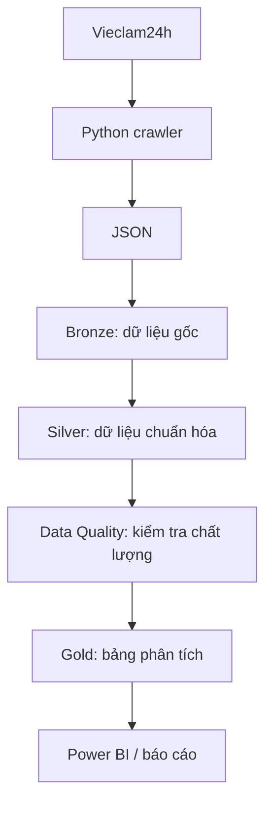
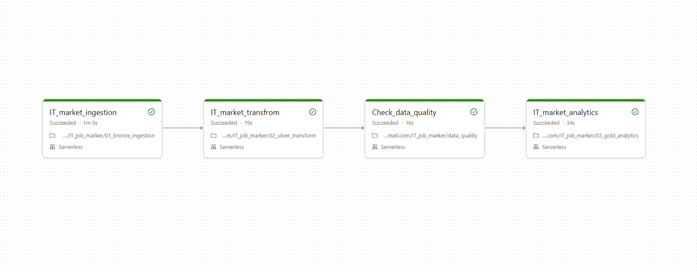
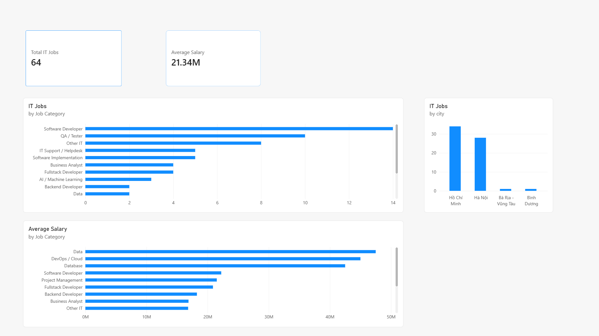

# Job Market Analytics — Phân tích thị trường việc làm IT Việt Nam

Dự án thu thập và phân tích dữ liệu tuyển dụng IT tại Việt Nam, nhằm tìm hiểu nhu cầu tuyển dụng theo địa phương, nhóm nghề, kỹ năng và mức lương. Dữ liệu được lấy từ Vieclam24h, lưu dưới dạng JSON, sau đó xử lý trên Databricks theo luồng Bronze → Silver → Data Quality → Gold để phục vụ phân tích và trực quan hóa.

## 1. Mục tiêu

- Xây dựng luồng dữ liệu từ thu thập, lưu trữ đến chuẩn hóa và phân tích.
- Xác định các nhóm nghề IT và địa phương có nhiều tin tuyển dụng.
- So sánh mức lương được công khai giữa các nhóm nghề.
- Thống kê kỹ năng thường xuất hiện trong mô tả và yêu cầu công việc.
- Kiểm tra chất lượng dữ liệu trước khi sử dụng cho báo cáo.

## 2. Các thành phần hiện có

| Thành phần | Chức năng |
|---|---|
| Crawler Python | Lấy danh sách và nội dung chi tiết tin tuyển dụng từ Vieclam24h |
| Lưu trữ JSON | Lưu dữ liệu theo thời điểm thu thập để có thể xử lý lại |
| Chuẩn hóa Python | Tách khoảng lương, chuẩn hóa tên thành phố và tách địa chỉ |
| Bronze | Đọc JSON, bổ sung thời gian nạp dữ liệu và ghi bảng Delta `bronze_jobs` |
| Silver | Chuẩn hóa lương, địa điểm; nhận diện tin IT, nhóm nghề và cấp bậc |
| Data Quality | Kiểm tra trùng lặp, trường bắt buộc, khoảng lương và độ bao phủ kỹ năng |
| Gold | Tổng hợp số tin theo thành phố, nhóm nghề, mức lương và nhu cầu kỹ năng sau bước kiểm tra chất lượng |
| Tài liệu minh họa | Hình ảnh workflow Databricks và dashboard Power BI |

## 3. Luồng xử lý dữ liệu



Bronze lưu dữ liệu gốc; Silver chuẩn hóa dữ liệu; Data Quality kiểm tra dữ liệu trước khi chuyển sang Gold. Chỉ tiếp tục bước Gold khi các kiểm tra mức `ERROR` đều đạt. Gold tạo các bảng tổng hợp phục vụ dashboard và báo cáo.

Các bảng phân tích chính:

- `gold_jobs_by_city`: số tin IT theo thành phố.
- `gold_jobs_by_title`: số tin theo nhóm nghề IT.
- `gold_salary_by_title`: lương trung bình từ trung điểm khoảng lương, lương thấp nhất và cao nhất theo nhóm nghề.
- `job_skills`: các kỹ năng được trích xuất cho từng tin tuyển dụng.
- `gold_skill_demand`: số tin tuyển dụng có đề cập từng kỹ năng.

## 4. Công nghệ sử dụng

- **Python, Requests, BeautifulSoup**: tải HTML và trích xuất nội dung.
- **JSON**: lưu dữ liệu thu thập tại máy cục bộ.
- **Databricks, PySpark, Spark SQL, Delta Lake**: xử lý và lưu các tầng dữ liệu.
- **Power BI**: trực quan hóa kết quả phân tích.
- **pytest**: kiểm thử các hàm xử lý dữ liệu.

`requirements.txt` chứa các thư viện cho phần Python cục bộ. Các notebook sử dụng môi trường Databricks có Spark và Delta Lake.

## 5. Cấu trúc dự án

```text
Job_market_analysticss/
├── crawler/
│   ├── fetcher.py                 # Tải nội dung trang
│   └── vieclam24h/
│       ├── crawler.py             # Thu thập danh sách và chi tiết tin
│       └── parser.py              # Trích xuất dữ liệu từ HTML
├── transform/
│   ├── salary.py                  # Chuẩn hóa khoảng lương
│   ├── location.py                # Chuẩn hóa thành phố, địa chỉ
│   └── transformer.py             # Chưa có triển khai
├── storage/
│   ├── storage.py                 # Lưu JSON vào storage/raw/
│   ├── test_storage.py            # Lưu JSON vào storage/raw_test/
│   └── test_transform.py          # Lưu JSON vào storage/transformed/
├── tests/
│   ├── test_crawl.py              # Script thu thập thử một trang
│   ├── test_transform.py          # Script chuyển đổi dữ liệu mới nhất
│   ├── test_location.py           # Kiểm thử chuẩn hóa địa điểm
│   ├── load_lastest_data.py       # Đọc JSON mới nhất trong raw_test/
│   └── report.py                  # Báo cáo profiling
├── notebooks/
│   ├── 01_bronze_ingestion.ipynb
│   ├── 02_silver_transform.ipynb
│   ├── 03_gold_analytics.ipynb
│   └── data_quality.ipynb
├── dashboard/powerbi_dashboard.png
├── docs/databricks_workflow.png
├── main.py
├── requirements.txt
├── PROJECT_DESIGN.md
└── README.md
```

Các thư mục dữ liệu đầu ra được tạo khi chạy và được bỏ qua trong `.gitignore`.

## 6. Cài đặt và chạy cục bộ

### Cài đặt

Sử dụng Python **3.10 trở lên**. Chạy các lệnh từ thư mục gốc dự án:

```powershell
python -m venv .venv
.\.venv\Scripts\Activate.ps1
python -m pip install -r requirements.txt
```

### Thu thập thử một trang

```powershell
python -m tests.test_crawl
```

Dữ liệu được lưu tại `storage/raw_test/jobs_<timestamp>.json`. Lệnh này truy cập website thực tế và cần kết nối mạng.

### Chuẩn hóa dữ liệu đã thu thập

```powershell
python -m tests.test_transform
```

Script đọc file JSON mới nhất trong `storage/raw_test/` và ghi kết quả vào `storage/transformed/`. Cần chạy bước thu thập thử trước hoặc cung cấp một file JSON phù hợp trong thư mục đầu vào.

Ví dụ: `10 - 20 triệu` được chuyển thành `salary_min = 10000000`, `salary_max = 20000000`, `salary_currency = "VND"`; `TP.HCM : Quận 7` được tách thành `city = "Hồ Chí Minh"`, `address = "Quận 7"`. Lương thỏa thuận hoặc định dạng chưa hỗ trợ được giữ dưới dạng giá trị thiếu.

### Kiểm thử địa điểm

```powershell
python -m pytest tests/test_location.py -q
```

### Trạng thái `main.py`

`main.py` được thiết kế để thu thập trang 1–14, lưu dữ liệu vào `storage/raw/` và in báo cáo profiling. Hiện `tests/report.py` còn import `profiling.profier`, nhưng module này không có trong workspace, nên `python main.py` chưa chạy được. Có thể sử dụng các script thu thập thử và chuẩn hóa ở trên cho phần cục bộ.

## 7. Chạy pipeline trên Databricks

1. Đưa file JSON thu thập lên một Volume trên Databricks.
2. Import các notebook trong `notebooks/` vào workspace Databricks.
3. Sửa đường dẫn JSON trong `01_bronze_ingestion.ipynb` thành đường dẫn Volume của bạn; đường dẫn hiện tại trỏ đến một file mẫu cụ thể.
4. Chọn compute hỗ trợ PySpark và Delta Lake, đồng thời cấu hình catalog/schema có quyền tạo bảng.
5. Chạy theo thứ tự: `01_bronze_ingestion` → `02_silver_transform` → `data_quality` → `03_gold_analytics`.
6. Sử dụng các bảng Gold để xây dựng báo cáo hoặc kết nối Power BI.

Các notebook hiện ghi bảng bằng chế độ `overwrite`: mỗi lần chạy sẽ thay thế dữ liệu của bảng đích. Notebook chất lượng dữ liệu sẽ phát sinh lỗi nếu có kiểm tra mức `ERROR` thất bại.

**Lưu ý về mã notebook hiện tại:** `data_quality.ipynb` đang đọc cả bảng `job_skills`, trong khi bảng này được tạo trong `03_gold_analytics.ipynb`. Để chạy đúng thứ tự trên ngay từ lần đầu, cần chuyển phần tạo `job_skills` sang bước Silver hoặc điều chỉnh kiểm tra độ bao phủ kỹ năng để không phụ thuộc vào đầu ra Gold.

## 8. Hình ảnh minh họa

### Workflow Databricks



### Dashboard Power BI



Repository hiện chứa ảnh minh họa dashboard; chưa có file báo cáo `.pbix`.

## 9. Giới hạn hiện tại và hướng phát triển

- Parser phụ thuộc vào cấu trúc HTML của website; thay đổi giao diện có thể khiến dữ liệu thiếu hoặc thu thập thất bại.
- Parser lấy `source_job_id` từ phần `id< số >` ở cuối đường dẫn tin tuyển dụng (ví dụ `id200947717.html` → `200947717`). Nếu URL không có định dạng này, parser tạo mã SHA-256 từ tên miền và đường dẫn, bỏ qua tham số tracking và fragment. Các file dữ liệu cũ cần được thu thập hoặc xử lý lại để cập nhật mã định danh.
- Chuẩn hóa lương hiện tập trung vào dạng khoảng `X - Y triệu`; chưa xử lý đầy đủ ngoại tệ, lương một phía hoặc kỳ trả lương khác nhau.
- Phân nhóm nghề, cấp bậc và kỹ năng trong notebook dựa trên từ khóa, cần đánh giá thêm độ chính xác.
- Lương công khai trong tin tuyển dụng chỉ phản ánh một phần dữ liệu thu thập, chưa đại diện cho toàn bộ thị trường.

Các bước mở rộng gồm hoàn thiện pipeline cục bộ, xử lý trùng lặp và nạp dữ liệu tăng dần, tự động hóa lịch chạy, theo dõi xu hướng theo thời gian và xây dựng mô hình dự đoán lương. Airflow, PostgreSQL, API và mô hình Machine Learning là các định hướng trong [PROJECT_DESIGN.md](PROJECT_DESIGN.md), chưa phải các thành phần đã triển khai trong repository hiện tại.

Khi thu thập dữ liệu, cần tuân thủ điều kiện sử dụng của nguồn và giới hạn tần suất truy cập phù hợp.
